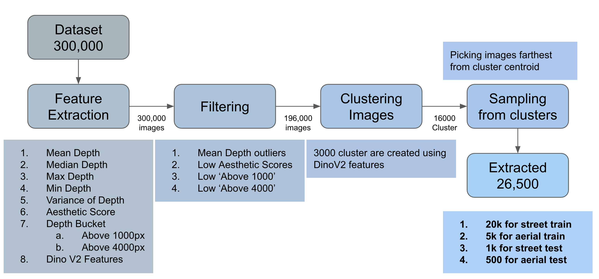

# MatrixCity For Depth 
<div align="center">
  
</div>

## Pipeline Explained 
<div align="center">
  
</div>

## Follow the following
```
pip install tarfile open_clip gradio
```
### Download Big City
```bash
python big_city_download/download.py --dataset_dir MatrixCity --depth --rgb          
```

### Concatenate 
Make sure to concatenate the subtar files.
```
cat tar.00 tar01 tar02
```

### Add the base dir to environment
```bash
export BASE_DIR=/mnt/c1e1833e-4df6-4c4c-88aa-8cd3d7d3932b/om/MatrixCity/MatrixCity
```
### Extract List of Images From Tar files
```bash
python list_images.py
```

### Randomly sample 1/3rd of dataset
```bash
python random_sample_101k.py 
```
This is optional, 
set SAMPLE_DATA = False, if you want to use the whole data 

### Extract Sampled files
```bash
python extract_sampled_image.py
```

### Filter the images
```bash
python filter.py
```

### Calculate DinoV2 features
```bash
python create_image_embeddings
```

### Extract Final representative images
```bash
python image_selection.py
```

### View Images 
```bash 
python gradio_grid_view_flag.py --csv_path csv/final_data_street_test_1k.csv --first_k 1000 --port 7860 
```