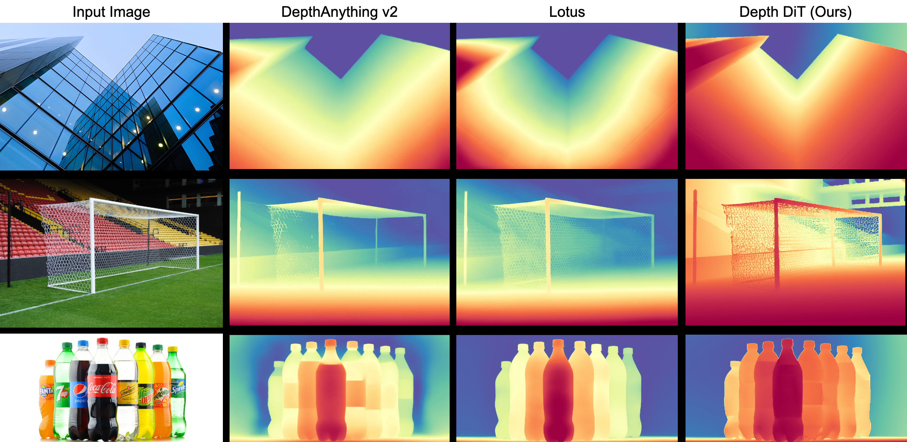

# DepthDiT
This work was done, while at VAL under the supervision of Ankit Dhiman.
<div align="center">
  
</div>

### Implements depth estimation using Diffusion Transformer.

### Supports:
- Training, inference, and evaluation scripts.
- Distributed training with accelerate.
- Customizable configs for datasets, model, and loss setup.
- Efficient inference with batched processing and post-processing tools.

### Datasets used: 
- Hypersim 
- Vkitti 
- [Matrixcity](Matrixcity/README.md)

## Getting Started 

### Setting up 
```bash
conda create -n DiT python=3.12 
pip install torch==2.5.1 torchvision==0.20.1 --index-url https://download.pytorch.org/whl/cu124
pip install -r requirements.txt
```
### Download Checkpoint 
```bash
mkdir -p checkpoints
wget -O checkpoints/0034000.pt https://huggingface.co/omrastogi/depth_dit/resolve/main/DiT/vkitti_hypersim_mixed_training_continued/checkpoints/0034000.pt
```
### Inference

```bash
python inference_depth.py \
  --model DiT-XL/2 \
  --image-size 512 \
  --batch-size 9 \
  --num-sampling-steps 20 \
  --ckpt checkpoint/0034000.pt \
  --image-path assets/in_the_wild \
  --output-path outputs/
```

### Training

To train a new DiT model for depth estimation, use the `train_depth.py` script. This script supports distributed training and various configurations. For example, to train a DiT-XL/2 model on 2 GPU, run:

You can find an example config at `config/training_config.yaml`.  
Modify this file to set up your own dataset paths, augmentation, and training options.

```bash
torchrun --nnodes=1 --nproc_per_node=2  train_depth.py \
--model DiT-XL/2 \
--valid-mask-loss \
--epochs 6 \
--validation-every 1000 \
--global-batch-size 20 \
--ckpt-every 2000 \
--image-size 512 \
--data-path data
```


### Evaluation

#### Benchmark Inference

```bash
python infer.py \
--model DiT-XL/2 \
--image-size 512 \
--batch-size 10 \
--num-sampling-steps 50 \
--ensemble-size 10 \
--dataset-config config/dataset/data_nyu_test.yaml \
--base-data-dir /mnt/51eb0667-f71d-4fe0-a83e-beaff24c04fb/om/depth_estimation_experiments/Marigold/eval_dataset \
--ckpt /mnt/51eb0667-f71d-4fe0-a83e-beaff24c04fb/om/depth_estimation_experiments/DiT/results/model_vkitti_hypersim_4_epoch_multires/checkpoints/0014000.pt \
--output-dir /mnt/51eb0667-f71d-4fe0-a83e-beaff24c04fb/om/depth_estimation_experiments/DiT/results/model_vkitti_hypersim_4_epoch_multires/batch_eval/nyu_test/prediction 
```

#### Evaluation

```bash
python eval.py \
--base_data_dir /mnt/51eb0667-f71d-4fe0-a83e-beaff24c04fb/om/depth_estimation_experiments/Marigold/eval_dataset \
--dataset_config config/dataset/data_nyu_test.yaml \
--alignment least_square \
--prediction_dir /mnt/51eb0667-f71d-4fe0-a83e-beaff24c04fb/om/depth_estimation_experiments/DiT/results/model_vkitti_hypersim_4_epoch_multires/batch_eval/nyu_test/prediction \
--output_dir /mnt/51eb0667-f71d-4fe0-a83e-beaff24c04fb/om/depth_estimation_experiments/DiT/results/model_vkitti_hypersim_4_epoch_multires/batch_eval/nyu_test/eval_metric \
```

# Drawbacks: 
1. Low model resolution i.e. 512, that decrease the size of the image 
2. The model evalutions are slightly lower than Marigold 

# What ideas failed
1. Adding extra feature via cross-attention
2. Training on better pretrained model also did give results 

# Extras
1. Check the READMEs in the respective subdirectories:
   - [PixArt README](experiments/PixArt-sigma/README.md)
   - [Sana README](experiments/Sana/README.md)
2. DiT checkpoint - https://huggingface.co/omrastogi/depth_dit/tree/main
3. Hypersim-Processed - https://huggingface.co/datasets/omrastogi/Hypersim-Processed

# Related Work 
1. [Marigold](https://marigoldmonodepth.github.io/): a finetuned diffusion model for estimating monocular depth.
2. [Lotus](https://lotus3d.github.io/): one-step diffusion model with x0 prediction for depth estimation 
3. [OneDiffusion](https://lehduong.github.io/OneDiffusion-homepage/): Modified NextDiT with video frame mechanism for diverse tasks, including depth 
4. [Diception](https://aim-uofa.github.io/Diception/): End to end training MM-DiT for general perception task

